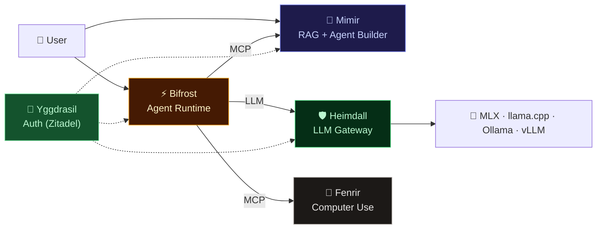

# 🏰 Asgard AI Platform

> *The realm of the gods — a self-hosted AI agent platform built on Apple Silicon & NVIDIA GPU*

**Asgard** is an open ecosystem of AI services designed to run entirely on local hardware. From LLM inference to autonomous agent execution and computer control — everything runs on-premises with zero cloud dependency.

Originally built to power AI NPCs for **Ragnarok Online**, Asgard has evolved into a general-purpose AI platform for healthcare, knowledge management, and autonomous workflows.

**📚 [Full Documentation →](docs/README.md)** | **📊 [Platform Review →](docs/strategy/platform-review.md)** | **🎯 [Competitor Analysis →](docs/strategy/competitor-analysis.md)**

---

## 🏗️ Architecture

---

## 📦 Components

| Component | Description | Tech Stack | Status |
|:--|:--|:--|:--|
| 🧠 **[Mimir](https://github.com/megacare-dev/Mimir)** | RAG Pipeline, Agent Builder, Dashboard | Rust (Axum + Rig.rs), Next.js 14, MariaDB, Qdrant | ✅ Sprint 8 |
| 🛡️ **[Heimdall](https://github.com/megacare-dev/Heimdall)** | LLM Gateway — multi-backend proxy with auth & metrics | Rust (Axum) | ✅ Production |
| ⚡ **[Bifrost](https://github.com/megacare-dev/Bifrost)** | Agent Runtime Engine — ReAct loop, tool execution, A2A | Python (FastAPI) | 🚧 Scaffolding |
| 🐺 **[Fenrir](https://github.com/megacare-dev/Fenrir)** | Computer-Use Agent — browser, shell, screen control | Rust (ZeroClaw) | 📋 Planned |
| 🌳 **Yggdrasil** | Centralized Auth — SSO, RBAC, audit | Zitadel (Go) | 📋 Planned |
| 🏰 **Asgard** *(this repo)* | Ecosystem docs, architecture, Docker Compose | — | **Public** |

---

## 🎯 Mission

Build a **self-hosted AI platform** that enables:

1. 📚 **Knowledge Management** — Ingest, chunk, embed, and search documents with RAG
2. 🤖 **Autonomous Agents** — Create and deploy agents that reason, use tools, and take actions
3. 🌐 **Computer Control** — Agents that browse the web, fill forms, extract data
4. 🎮 **AI NPCs** — Intelligent characters for Ragnarok Online with memory and personality
5. 🏥 **Healthcare AI** — Medical knowledge assistants with domain-specific models

---

## 🔧 Hardware

#### 🍎 Apple Silicon (MLX / llama.cpp / Ollama)

| Tier | Hardware | Users | Model Size |
|:--|:--|:--|:--|
| Starter | Mac Mini M4 (16GB) | 1-5 | 7B |
| Standard | Mac Mini M4 Pro (36GB) | 10-20 | 14B |
| Pro | Mac Mini M4 Pro (64GB) | 20-50 | 30B+ |
| Max | Mac Studio M4 Ultra (192GB) | 50-200 | 70B+ |

#### 🟢 NVIDIA (vLLM + CUDA)

| Tier | Hardware | Users | Model Size |
|:--|:--|:--|:--|
| DGX Spark | NVIDIA DGX Spark (128GB) | 50-200 | 70B+ |
| DGX Station | NVIDIA DGX Station | 200+ | Multi-model |

> All LLM inference runs locally — zero cloud dependency.

---

## 🗺️ Roadmap

> **[Full Roadmap with Gantt Chart →](docs/strategy/roadmap.md)**

### Phase 1: Foundation ✅
- [x] Heimdall — LLM Gateway with multi-backend support
- [x] Mimir — RAG Pipeline with document ingestion
- [x] Mimir — Agent Builder (CRUD, templates, chat)
- [x] Dashboard — Next.js admin UI
- [x] Multi-model benchmarking (Qwen, Gemma, MedGemma)
- [x] AGPL-3.0 licensing + CLA

### Phase 2: Agent Runtime & Integrations 🚧
- [ ] Bifrost — Agent Executor (ReAct loop, tool execution)
- [ ] MCP tool integration + session management
- [ ] Yggdrasil — Centralized Auth (Zitadel)
- [ ] Heimdall — vLLM backend for NVIDIA GPU
- [ ] Mimir — Visual Workflow Builder (ReactFlow)
- [ ] Mimir — A2A Server (Agent-to-Agent protocol)
- [ ] Unified Docker Compose (all components)

### Phase 3: Computer Use & Growth
- [ ] Fenrir — Browser automation, form filling, data extraction
- [ ] Bifrost — A2A Client for external agents
- [ ] Agent Template Marketplace
- [ ] Knowledge Graph (Neo4j — Mimir Sprint 11)
- [ ] Community v1.0 Launch

### Enterprise Edition 💰
- [ ] SSO (SAML, OIDC, LDAP) via Zitadel
- [ ] Usage Analytics + Cost Dashboard
- [ ] HA Clustering (multi-node)
- [ ] Priority Support + SLA

---

## 🏛️ Norse Naming

| Name | Origin | Role |
|:--|:--|:--|
| **Asgard** | Realm of the gods | The platform |
| **Mimir** | God of wisdom | Knowledge & RAG |
| **Heimdall** | Guardian of Bifrost | LLM Gateway |
| **Bifrost** | Rainbow bridge | Agent Runtime |
| **Fenrir** | The great wolf | Computer use |
| **Yggdrasil** | The world tree | Auth service |

---

## 📄 License

- **Community**: [AGPL-3.0](LICENSE)
- **Enterprise**: [Commercial License](COMMERCIAL.md)
- **Contributing**: [CLA](CLA.md)

---

  <strong>🏰 Asgard AI Platform</strong>
   
  <em>Self-hosted AI. Norse-inspired. Built on Apple Silicon & NVIDIA GPU.</em>
    
  <a href="https://github.com/megacare-dev/Mimir">Mimir</a> ·
  <a href="https://github.com/megacare-dev/Heimdall">Heimdall</a> ·
  <a href="https://github.com/megacare-dev/Bifrost">Bifrost</a> ·
  <a href="https://github.com/megacare-dev/Fenrir">Fenrir</a>

