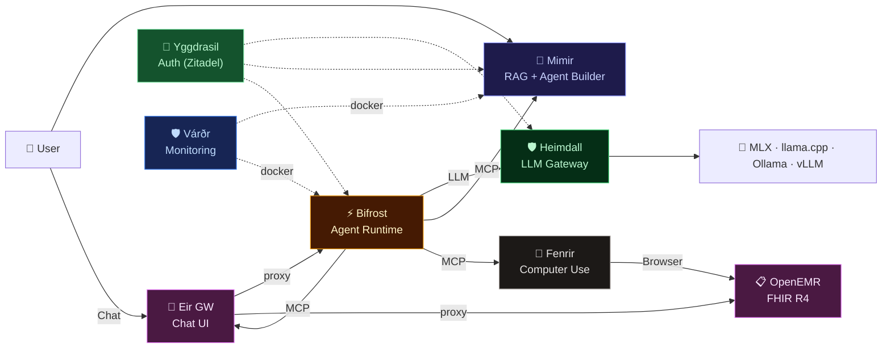

# 🏰 Asgard AI Platform

> **Asgard เป็นของทุกคนแล้ว — Asgard belongs to everyone.**

> *The realm of the gods — a self-hosted AI agent platform built on Apple Silicon & NVIDIA GPU*

**Asgard** is an open ecosystem of AI services designed to run entirely on local hardware. From LLM inference to autonomous agent execution and computer control — everything runs on-premises with zero cloud dependency.

Originally built to power AI NPCs for **Ragnarok Online**, Asgard has evolved into a general-purpose AI platform for healthcare, knowledge management, and autonomous workflows.

**📚 [Full Documentation →](docs/README.md)** | **📊 [Platform Review →](docs/strategy/platform-review.md)** | **🎯 [Competitor Analysis →](docs/strategy/competitor-analysis.md)**

---

## 🏗️ Architecture

---

## 📦 Components

| Component | Description | Tech Stack | Tests | Status |
|:--|:--|:--|:--|:--|
| 🧠 **[Mimir](https://github.com/megacare-dev/Mimir)** | RAG Pipeline, Agent Builder, Dashboard | Rust (Axum), Next.js 14, MariaDB, Qdrant | 255+ | ✅ Sprint 28 |
| 🛡️ **[Heimdall](https://github.com/megacare-dev/Heimdall)** | LLM Gateway — multi-backend proxy | Rust (Axum) | Benchmarked | ✅ Production |
| ⚡ **[Bifrost](https://github.com/megacare-dev/Bifrost)** | Agent Runtime — ReAct loop, MCP, A2A, PSO | Python (FastAPI) | 99 | ✅ Sprint 4 |
| 🐺 **[Fenrir](https://github.com/megacare-dev/Fenrir)** | Computer-Use Agent — Browser Use + FHIR R4 + Messaging | Python (FastAPI) | 47 | ✅ Sprint 1.5 |
| 🏥 **[Eir](https://github.com/megacare-dev/openemr)** | Rust API Gateway + OpenEMR, Chat UI, MCP Server | Rust (Axum) + PHP | 47 | ✅ Sprint 3 |
| 🌳 **[Yggdrasil](https://github.com/megacare-dev/Yggdrasil)** | Auth Service — Zitadel OIDC + JWT + FastAPI Auth | Zitadel (Go) + Python | 31 | ✅ Sprint 2 |
| 🛡️ **[Várðr](https://github.com/megacare-dev/Vardr)** | Monitoring Dashboard — health, logs, metrics | Rust (Axum) | 5 | ✅ Sprint 1 |
| 🏰 **Asgard** *(this repo)* | Docker Compose, docs, strategy | — | — | ✅ Active |

> **484+ tests** across the entire platform · **MCP** for tool calls · **A2A** for task delegation

---

## 🎯 Mission

Build a **self-hosted AI platform** that enables:

1. 📚 **Knowledge Management** — Ingest, chunk, embed, and search documents with RAG
2. 🤖 **Autonomous Agents** — Create and deploy agents that reason, use tools, and take actions
3. 🌐 **Computer Control** — Agents that browse the web, fill forms, extract data
4. 🎮 **AI NPCs** — Intelligent characters for Ragnarok Online with memory and personality
5. 🏥 **Healthcare AI** — Medical knowledge assistants with domain-specific models

---

## 🔧 Hardware

#### 🍎 Apple Silicon (MLX / llama.cpp / Ollama)

| Tier | Hardware | Users | Model Size |
|:--|:--|:--|:--|
| Starter | Mac Mini M4 (16GB) | 1-5 | 7B |
| Standard | Mac Mini M4 Pro (36GB) | 10-20 | 14B |
| Pro | Mac Mini M4 Pro (64GB) | 20-50 | 30B+ |
| Max | Mac Studio M4 Ultra (192GB) | 50-200 | 70B+ |

#### 🟢 NVIDIA (vLLM + CUDA)

| Tier | Hardware | Users | Model Size |
|:--|:--|:--|:--|
| DGX Spark | NVIDIA DGX Spark (128GB) | 50-200 | 70B+ |
| DGX Station | NVIDIA DGX Station | 200+ | Multi-model |

> All LLM inference runs locally — zero cloud dependency.

---

## 🗺️ Roadmap

> **[Full Roadmap with Gantt Chart →](docs/strategy/roadmap.md)**

### Phase 1: Foundation ✅
- [x] Heimdall — LLM Gateway (v0.4.0, multi-backend, benchmarked)
- [x] Mimir — RAG Pipeline + Agent Builder + Dashboard (Sprint 28, 255+ tests)
- [x] Bifrost — Agent Runtime (Sprint 4, ReAct + MCP + PSO, 99 tests)
- [x] Eir — Rust API Gateway + OpenEMR (Sprint 3, 47 tests)
- [x] Fenrir — Computer-Use Agent scaffold + OpenEMR Messaging (Sprint 1.5, 47 tests)
- [x] Yggdrasil — Auth Service (Sprint 2, Zitadel + JWT + FastAPI Auth, 31 tests)
- [x] Unified Docker Compose — 10 services, one command
- [x] AGPL-3.0 licensing + CLA

### Phase 2: Integration & Growth 🚧
- [ ] Eir Sprint 4 — MCP Server (FHIR tools) + Chat UI widget
- [ ] Bifrost Sprint 5 — MCP Integration (Eir + Fenrir clients)
- [ ] Mimir → Bifrost agent deployment via MCP
- [ ] Fenrir MVP — OpenEMR form automation
- [ ] Visual Workflow Builder (ReactFlow)
- [ ] Documentation site (asgardai.dev)
- [ ] Developer Preview (GitHub public)

### Phase 3: Community Launch
- [ ] v1.0 Community Edition
- [ ] Product Hunt / HackerNews launch
- [ ] 3-5 Design Partners

### Enterprise Edition 💰
- [ ] SSO (SAML, OIDC, LDAP) via Zitadel
- [ ] Usage Analytics + Cost Dashboard
- [ ] HA Clustering (multi-node)
- [ ] Priority Support + SLA

---

## 🏛️ Norse Naming

| Name | Origin | Role | Edition |
|:--|:--|:--|:--|
| **Asgard** | Realm of the gods | The platform | Community |
| **Mimir** | God of wisdom | Knowledge & RAG | Community |
| **Heimdall** | Guardian of Bifrost | LLM Gateway | Community |
| **Bifrost** | Rainbow bridge | Agent Runtime | Community |
| **Fenrir** | The great wolf | Computer use | Community |
| **Eir** | Goddess of healing | Clinic management (Gateway + OpenEMR) | Community |
| **Yggdrasil** | The world tree | Auth service | Community |
| **Várðr** | The guardian | Monitoring dashboard | Community |
| **Huginn** | Odin's raven (Thought) | Security Scanner | Enterprise |
| **Muninn** | Odin's raven (Memory) | Auto-Fixer (LLM) | Enterprise |

> **[Huginn & Muninn Roadmap →](docs/roadmap/huginn-muninn.md)**

---

## 📄 License

- **Community**: [AGPL-3.0](LICENSE)
- **Enterprise**: [Commercial License](COMMERCIAL.md)
- **Contributing**: [CLA](CLA.md)

---

  <strong>🏰 Asgard เป็นของทุกคนแล้ว — Asgard belongs to everyone.</strong>
   
  <em>Self-hosted AI. Norse-inspired. Built on Apple Silicon & NVIDIA GPU.</em>
    
  <a href="https://github.com/megacare-dev/Mimir">Mimir</a> ·
  <a href="https://github.com/megacare-dev/Heimdall">Heimdall</a> ·
  <a href="https://github.com/megacare-dev/Bifrost">Bifrost</a> ·
  <a href="https://github.com/megacare-dev/Fenrir">Fenrir</a> ·
  <a href="https://github.com/megacare-dev/Yggdrasil">Yggdrasil</a> ·
  <a href="https://github.com/megacare-dev/openemr">Eir</a> ·
  <a href="https://github.com/megacare-dev/Vardr">Várðr</a>

