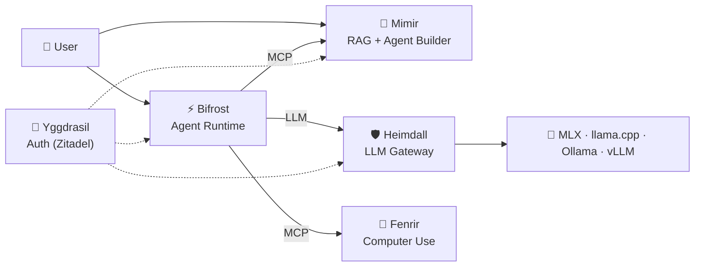

# 📚 Asgard AI Platform — Documentation

> Consolidated documentation for developers, partners, and investors.

---

## 📋 Table of Contents

### Strategy & Business

| Document | Description |
|:--|:--|
| 🎯 [Product Direction](strategy/product-direction.md) | Vision, design principles, anti-goals, strategic priorities |
| 📊 [Platform Review](strategy/platform-review.md) | Platform overview, strengths, gap analysis, licensing |
| 🗺️ [Roadmap](strategy/roadmap.md) | Development roadmap with Gantt chart and milestones |
| 🎯 [Competitor & Target Market Analysis](strategy/competitor-analysis.md) | 8 competitors analyzed, market gaps, positioning |
| 🗺️ [Gap → Project Mapping](strategy/gap-mapping.md) | Maps every gap to a specific project for implementation |

### Architecture & Technical

| Document | Description |
|:--|:--|
| 🏗️ [Architecture Overview](architecture.md) | System architecture, data flow, component specs |
| 🌳 [Yggdrasil Auth Selection](technical/yggdrasil-auth-selection.md) | Auth platform comparison — Zitadel selected |
| 🔧 [ADK-Rust Evaluation](technical/adk-rust-evaluation.md) | ADK-Rust analysis, workflow builder decision, A2A protocol |

### Legal & Community

| Document | Description |
|:--|:--|
| 📜 [LICENSE](../LICENSE) | AGPL-3.0 — Community Edition |
| 🏢 [COMMERCIAL.md](../COMMERCIAL.md) | Enterprise licensing information |
| 📝 [CLA.md](../CLA.md) | Contributor License Agreement |
| 👥 [CONTRIBUTORS.md](../CONTRIBUTORS.md) | Contributor list |
| 🤝 [CONTRIBUTING.md](../CONTRIBUTING.md) | How to contribute |
| 📜 [CODE_OF_CONDUCT.md](../CODE_OF_CONDUCT.md) | Community standards |

---

## 🏰 Platform Overview

| Component | Description | Tech | Status |
|:--|:--|:--|:--|
| 🛡️ **Heimdall** | LLM Gateway | Rust (Axum) | ✅ Production |
| 🧠 **Mimir** | RAG + Agent Builder | Rust (Axum) + Next.js 14 | ✅ Sprint 8 Done |
| ⚡ **Bifrost** | Agent Runtime | Python (FastAPI) | 🚧 Scaffolding |
| 🐺 **Fenrir** | Computer Use | Rust (ZeroClaw) | 📋 Planned |
| 🌳 **Yggdrasil** | Auth Service | Zitadel (Go) | 📋 Planned |

---

## 💼 For Investors

Recommended reading order:

1. **[Platform Review](strategy/platform-review.md)** — Understand the platform, roadmap, and licensing
2. **[Competitor Analysis](strategy/competitor-analysis.md)** — Market landscape and differentiation
3. **[COMMERCIAL.md](../COMMERCIAL.md)** — Business model and Enterprise features

---

## 📞 Contact

- 📧 Email: paripol@megawiz.co
- 🏢 Organization: [MegaWiz](https://github.com/megacare-dev)

---

© 2026 MegaWiz — Licensed under AGPL-3.0
