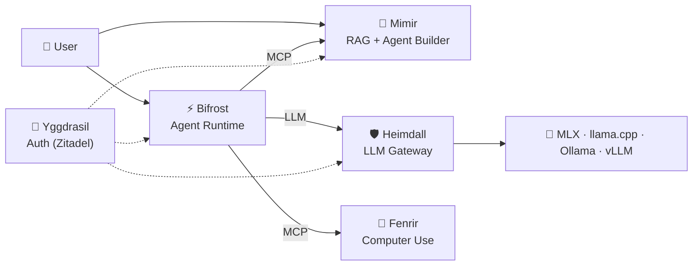

# 📚 Asgard AI Platform — Documentation

> เอกสารรวมของ Asgard AI Platform สำหรับ Developers, Partners, และ Investors

---

## 📋 สารบัญ (Table of Contents)

### Strategy & Business

| Document | Description |
|:--|:--|
| 📊 [Platform Review](strategy/platform-review.md) | ภาพรวม platform, จุดแข็ง, gap analysis, roadmap, licensing strategy |
| 🎯 [Competitor & Target Market Analysis](strategy/competitor-analysis.md) | วิเคราะห์คู่แข่ง 8 ราย, ช่องว่างตลาด, positioning |
| 🗺️ [Gap → Project Mapping](strategy/gap-mapping.md) | แผนที่ mapping gaps → projects สำหรับ implementation |

### Architecture & Technical

| Document | Description |
|:--|:--|
| 🏗️ [Architecture Overview](architecture.md) | System architecture, data flow, component specs |
| 🌳 [Yggdrasil Auth Selection](technical/yggdrasil-auth-selection.md) | การเลือก Auth platform (Zitadel) + migration plan |

### Legal & Licensing

| Document | Description |
|:--|:--|
| 📜 [LICENSE](../LICENSE) | AGPL-3.0 — Community Edition |
| 🏢 [COMMERCIAL.md](../COMMERCIAL.md) | Enterprise licensing information |
| 📝 [CLA.md](../CLA.md) | Contributor License Agreement |
| 👥 [CONTRIBUTORS.md](../CONTRIBUTORS.md) | Contributor list |

---

## 🏰 Platform Overview

| Component | Description | Tech | Status |
|:--|:--|:--|:--|
| 🛡️ **Heimdall** | LLM Gateway | Rust (Axum) | ✅ Production |
| 🧠 **Mimir** | RAG + Agent Builder | Rust (Axum) + Next.js 14 | ✅ Sprint 8 Done |
| ⚡ **Bifrost** | Agent Runtime | Python (FastAPI) | 🚧 Scaffolding |
| 🐺 **Fenrir** | Computer Use | Rust (ZeroClaw) | 📋 Planned |
| 🌳 **Yggdrasil** | Auth Service | Zitadel (Go) | 📋 Planned |

---

## 💼 For Investors

หากคุณสนใจ Asgard AI Platform ในเชิงธุรกิจ แนะนำอ่านตามลำดับ:

1. **[Platform Review](strategy/platform-review.md)** — เข้าใจ platform + roadmap
2. **[Competitor Analysis](strategy/competitor-analysis.md)** — เข้าใจตลาดและจุดต่าง
3. **[COMMERCIAL.md](../COMMERCIAL.md)** — Business model + Enterprise features

---

## 📞 Contact

- 📧 Email: enterprise@megacare.dev
- 🏢 Organization: [megacare-dev](https://github.com/megacare-dev)

---

© 2026 MegaCare Dev — Licensed under AGPL-3.0
