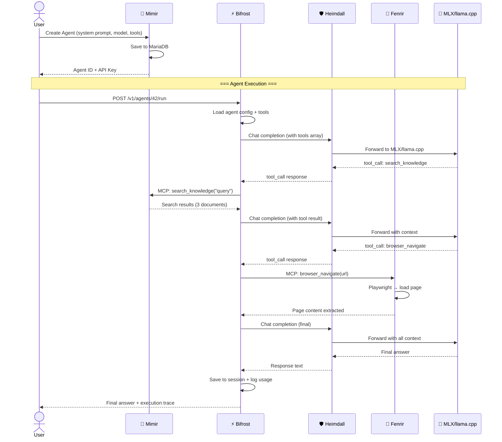

# 🏰 Asgard — System Architecture

> A self-hosted AI platform running entirely on Apple Silicon & NVIDIA GPU.
>
> *Updated: 2026-03-14 — Eir Gateway Chat UI, MCP/A2A integration protocol (8 components)*

## High-Level Overview

```mermaid
graph TB
    subgraph client["👤 Clients"]
        Dashboard["🖥️ Dashboard<br/>(Next.js)"]
        API["📡 External API<br/>(REST/SSE)"]
        Chat["💬 Chat Interface"]
    end

    subgraph asgard["🏰 Asgard AI Platform"]

        subgraph mimir["🧠 Mimir — Knowledge & Agent Builder"]
            RAG["📚 RAG Pipeline<br/>Ingest → Chunk → Embed → Search"]
            AgentBuilder["🤖 Agent Builder<br/>CRUD · Templates · Publish"]
            KB["💾 Knowledge Base<br/>(MariaDB + Qdrant)"]
            RAG --> KB
            AgentBuilder --> |"deploy agent"| BifrostLink["→ Bifrost"]
        end

        subgraph bifrost["⚡ Bifrost — Agent Runtime"]
            Executor["🔄 Agent Executor<br/>(ReAct Loop)"]
            Tools["🔧 Tool Registry<br/>(MCP Client)"]
            Sessions["💾 Session Manager<br/>Short-term + Long-term"]
            Router["🔀 Agent Router<br/>Multi-agent Handoff"]
            Executor --> Tools
            Executor --> Sessions
            Executor --> Router
        end

        subgraph heimdall["🛡️ Heimdall — LLM Gateway"]
            Proxy["🔄 Proxy Layer<br/>(Rust/Axum)"]
            Auth["🔐 Auth<br/>JWT / OIDC (Yggdrasil)"]
            Metrics["📊 Metrics<br/>(Prometheus)"]
            Proxy --> Auth
            Proxy --> Metrics
        end

        subgraph fenrir["🐺 Fenrir — Computer Use"]
            Browser["🌐 Browser Use<br/>Navigate · Extract · Fill"]
            FHIRClient["🏥 FHIR Client<br/>API-first"]
            Shell["💻 Shell Executor<br/>Commands · Scripts"]
            Files["📁 File Manager<br/>Read · Write · Search"]
        end

        subgraph eir["🏥 Eir — Clinic Management"]
            EirGW["💊 API Gateway<br/>Axum · MCP Server · Chat"]
            OpenEMR["📋 OpenEMR<br/>Patient · Encounter · Rx"]
            FHIRAPI["🔗 FHIR R4 API<br/>REST + OAuth2"]
            EirGW --> OpenEMR
            OpenEMR --> FHIRAPI
        end

        subgraph yggdrasil["🌳 Yggdrasil — Auth"]
            Zitadel["🔐 Yggdrasil<br/>OIDC · SAML · LDAP"]
            AuditLog["📋 Audit Trail<br/>Event-sourced"]
        end

        subgraph vardr["🛡️ Várðr — Monitoring"]
            Health["📊 Service Health<br/>Docker status"]
            Logs["📜 Log Viewer<br/>SSE streaming"]
            MetricsV["📈 Metrics<br/>CPU · RAM · Net"]
        end
    end

    subgraph backends["⚙️ LLM Backends"]
        MLX["🍎 MLX<br/>mlx_lm · mlx_vlm"]
        Llama["🦙 llama.cpp<br/>GGUF Models"]
        Ollama["🐫 Ollama<br/>Managed Models"]
        VLLM["🟢 vLLM<br/>NVIDIA CUDA"]
    end

    Dashboard --> mimir
    API --> bifrost
    Chat --> |"via Eir Chat"| EirGW
    EirGW --> |"proxy /v1/chat"| bifrost
    bifrost --> |"LLM calls"| heimdall
    bifrost --> |"RAG search<br/>(MCP)"| mimir
    bifrost --> |"Computer use<br/>(MCP)"| fenrir
    bifrost --> |"FHIR data<br/>(MCP)"| EirGW
    FHIRClient --> |"FHIR R4"| FHIRAPI
    Browser --> |"Browser"| OpenEMR

    heimdall --> MLX
    heimdall --> Llama
    heimdall --> Ollama
    heimdall --> VLLM

    yggdrasil -.-> |"JWT"| heimdall
    yggdrasil -.-> |"OIDC"| mimir
    yggdrasil -.-> |"JWT"| bifrost

    vardr -.-> |"docker CLI"| mimir
    vardr -.-> |"docker CLI"| bifrost
    vardr -.-> |"docker CLI"| heimdall
    vardr -.-> |"docker CLI"| fenrir
    vardr -.-> |"docker CLI"| yggdrasil
    style asgard fill:transparent,stroke:#6366f1,stroke-width:3px
    style mimir fill:#1e1b4b,stroke:#818cf8,color:#c7d2fe
    style bifrost fill:#451a03,stroke:#f59e0b,color:#fef3c7
    style heimdall fill:#052e16,stroke:#4ade80,color:#bbf7d0
    style fenrir fill:#1c1917,stroke:#a8a29e,color:#e7e5e4
    style eir fill:#4a1942,stroke:#e879f9,color:#fae8ff
    style yggdrasil fill:#14532d,stroke:#86efac,color:#bbf7d0
    style vardr fill:#172554,stroke:#3b82f6,color:#bfdbfe
    style backends fill:#0c0a09,stroke:#78716c
    style client fill:transparent,stroke:#94a3b8
```



---

## Integration Protocols: MCP vs A2A

Asgard uses **two** agent communication protocols:

| Protocol | Level | When to use | Standard |
|:--|:--|:--|:--|
| **MCP** (Model Context Protocol) | Tool-level | Single action, sync, fast | Anthropic/Google spec |
| **A2A** (Agent-to-Agent) | Agent-level | Complex task, async, multi-step | Google spec |

### MCP — Tool Calls
```
Bifrost (MCP Client) ──call──> Eir (MCP Server)
                                  └─ patient_search("สมชาย")
                                  └─ fhir_query("Condition?patient=1")

Bifrost (MCP Client) ──call──> Fenrir (MCP Server)
                                  └─ browser_navigate(url)
                                  └─ browser_fill_form(data)

Bifrost (MCP Client) ──call──> Mimir (MCP Server)
                                  └─ knowledge_search("query")
```

### A2A — Task Delegation
```
Bifrost ──A2A task──> Eir Agent
    "ลงทะเบียนคนไข้ สมชาย + insurance + นัดแพทย์"
     └─ Eir Agent คิดเอง: step1 → step2 → step3
     └─ Status updates: submitted → working → completed
     └─ Result: "ลงทะเบียนเสร็จ HN-0042"
```

### Decision Table
| Use Case | Protocol | Example |
|:--|:--|:--|
| ค้นหาคนไข้ | MCP | `eir.patient_search()` |
| ดึง Lab | MCP | `eir.fhir_query()` |
| กดปุ่มใน OpenEMR | MCP | `fenrir.browser_click()` |
| ค้นหา knowledge | MCP | `mimir.knowledge_search()` |
| ลงทะเบียน + insurance ทั้ง flow | A2A | `eir_agent.task_send()` |
| สร้าง Encounter + Vitals + Rx | A2A | `eir_agent.task_send()` |
| วิเคราะห์ + สรุปรักษา | A2A | `bifrost.delegate()` |

---

## Data Flow

### Agent Execution Flow



---

## Component Details

### 🧠 Mimir — Knowledge & Agent Builder

```mermaid
graph LR
    subgraph ingestion["📥 Document Ingestion"]
        Upload["Upload Files"]
        Crawl["Web Crawler"]
        DB["DB Connector"]
    end

    subgraph pipeline["⚙️ Processing Pipeline"]
        Extract["Extract Text"]
        Chunk["Smart Chunking"]
        Embed["Embedding<br/>(MLX)"]
        Dedup["Deduplication"]
    end

    subgraph storage["💾 Storage"]
        MariaDB["MariaDB<br/>(Relational)"]
        Vectors["Vector Store<br/>(Embeddings)"]
    end

    subgraph api["🔌 APIs"]
        Search["Semantic Search"]
        AgentAPI["Agent CRUD"]
        DashAPI["Dashboard API"]
    end

    ingestion --> pipeline --> storage
    storage --> api

    style ingestion fill:#312e81,stroke:#818cf8
    style pipeline fill:#312e81,stroke:#818cf8
    style storage fill:#1e1b4b,stroke:#6366f1
    style api fill:#1e1b4b,stroke:#6366f1
```



| Feature | Description |
|:--|:--|
| **Stack** | Rust (Axum + Rig.rs) + Next.js 14 + MariaDB + Qdrant |
| **Port** | `3000` (API) / `3001` (Dashboard) |
| **Repo** | [MegaWiz-Dev-Team/Mimir](https://github.com/MegaWiz-Dev-Team/Mimir) |

---

### 🛡️ Heimdall — LLM Gateway

```mermaid
graph LR
    Client["Client Request<br/>/v1/chat/completions"] --> Auth["🔐 Auth<br/>Bearer Token"]
    Auth --> Router["🔄 Router<br/>Model → Backend"]
    Router --> MLX["🍎 mlx_lm<br/>:8081"]
    Router --> VLM["👁️ mlx_vlm<br/>:8082"]
    Router --> LC["🦙 llama.cpp<br/>:8083"]
    Router --> OL["🐫 Ollama<br/>:11434"]
    Router --> VL["🟢 vLLM<br/>:8084"]

    MLX --> Response["📤 Response<br/>(SSE Stream)"]
    VLM --> Response
    LC --> Response
    OL --> Response
    VL --> Response

    Response --> Metrics["📊 Prometheus<br/>Metrics"]

    style Auth fill:#052e16,stroke:#4ade80
    style Router fill:#052e16,stroke:#4ade80
    style Metrics fill:#052e16,stroke:#4ade80
```



| Feature | Description |
|:--|:--|
| **Stack** | Rust (Axum + Tokio) |
| **Port** | `8080` |
| **Protocol** | OpenAI-compatible API |
| **Backends** | MLX, mlx_vlm, llama.cpp, Ollama, vLLM |
| **Repo** | [MegaWiz-Dev-Team/Heimdall](https://github.com/MegaWiz-Dev-Team/Heimdall) |

---

### ⚡ Bifrost — Agent Runtime

```mermaid
graph TB
    Input["📩 User Message"] --> Context["📋 Build Context<br/>System Prompt + History + Tools"]
    Context --> LLM["🤖 Call LLM<br/>(via Heimdall)"]
    LLM --> Decision{Response Type?}

    Decision --> |"tool_call"| Execute["🔧 Execute Tool<br/>(MCP)"]
    Execute --> Append["📝 Append Result"]
    Append --> LLM

    Decision --> |"text"| Final["✅ Final Answer"]
    Final --> Log["📊 Log Trace + Usage"]
    Log --> Return["📤 Return to User"]

    style Input fill:#451a03,stroke:#f59e0b
    style LLM fill:#451a03,stroke:#f59e0b
    style Execute fill:#451a03,stroke:#f59e0b
    style Final fill:#422006,stroke:#fbbf24
```



| Feature | Description |
|:--|:--|
| **Stack** | Python (FastAPI + Uvicorn) |
| **Port** | `8100` |
| **Protocol** | REST + SSE + MCP Client |
| **Repo** | [MegaWiz-Dev-Team/Bifrost](https://github.com/MegaWiz-Dev-Team/Bifrost) |

---

### 🐺 Fenrir — Computer Use

```mermaid
graph LR
    MCP["📡 MCP Server<br/>(Python)"] --> Browser["🌐 Browser Use<br/>Playwright"]
    MCP --> FHIR["🏥 FHIR R4<br/>OpenEMR API"]
    MCP --> Shell["💻 Shell<br/>Sandboxed"]
    MCP --> FileOps["📁 Files<br/>Scoped"]

    Browser --> Web["Navigate · Extract · Fill · Screenshot"]
    FHIR --> EMR["Patient · Encounter · Observation"]
    Shell --> Cmd["Run commands · Execute scripts"]
    FileOps --> FS["Read · Write · Search"]

    style MCP fill:#1c1917,stroke:#a8a29e
    style Browser fill:#292524,stroke:#78716c
    style FHIR fill:#292524,stroke:#78716c
    style Shell fill:#292524,stroke:#78716c
    style FileOps fill:#292524,stroke:#78716c
```



| Feature | Description |
|:--|:--|
| **Stack** | Python (Browser Use + FHIR Client) |
| **Port** | `8200` (localhost only) |
| **Protocol** | MCP Server |
| **Browser** | Browser Use (Playwright-based, natural language) |
| **API** | FHIR R4 Client for OpenEMR (API-first approach) |
| **Security** | Sandbox, localhost-only, no external LLM for patient data |
| **Repo** | [MegaWiz-Dev-Team/Fenrir](https://github.com/MegaWiz-Dev-Team/Fenrir) |

---

### 🏥 Eir — API Gateway + Clinic Management

```mermaid
graph LR
    subgraph eirgw["💊 Eir Gateway (:8300)"]
        Proxy["🔄 Reverse Proxy<br/>→ OpenEMR :80"]
        ChatUI["💬 Chat UI<br/>Embedded Widget"]
        MCPSrv["📡 MCP Server<br/>FHIR Tools"]
        A2ASrv["🤖 A2A Protocol<br/>Task delegation"]
        RateLimit["⏱️ Rate Limiter<br/>Governor"]
        Cache["📦 Cache<br/>Moka (in-memory)"]
    end

    Bifrost["⚡ Bifrost"] --> |"MCP"| MCPSrv
    Bifrost --> |"A2A"| A2ASrv
    ChatUI --> |"POST /v1/chat"| Bifrost
    MCPSrv --> FHIR["🏥 OpenEMR<br/>FHIR R4"]
    Proxy --> FHIR

    style eirgw fill:#4a1942,stroke:#e879f9
```



| Feature | Description |
|:--|:--|
| **Stack** | Rust (Axum + Tokio) |
| **Port** | `8300` (Gateway) / `80` (OpenEMR) |
| **Protocol** | MCP Server + A2A + REST Proxy |
| **Features** | Chat UI widget, FHIR proxy, rate limiting, caching, audit log |
| **Chat** | `GET /chat` (standalone) + 🐺 embedded widget on OpenEMR |
| **Repo** | [MegaWiz-Dev-Team/Eir](https://github.com/MegaWiz-Dev-Team/Eir) |

---

### 🛡️ Várðr — Monitoring Dashboard

```mermaid
graph LR
    subgraph vardr["🛡️ Várðr Dashboard"]
        Services["📊 Services Tab<br/>Health · Ports · Uptime"]
        LogViewer["📜 Logs Tab<br/>Filter · Search · SSE"]
        MetricsView["📈 Metrics Tab<br/>CPU · RAM · Net · PIDs"]
    end

    Docker["🐳 Docker Engine"] --> |"docker ps"| Services
    Docker --> |"docker logs"| LogViewer
    Docker --> |"docker stats"| MetricsView

    Browser["🌐 Browser"] --> |":9090"| vardr

    style vardr fill:#172554,stroke:#3b82f6
    style Docker fill:#0c4a6e,stroke:#38bdf8
    style Browser fill:#1e293b,stroke:#94a3b8
```



| Feature | Description |
|:--|:--|
| **Stack** | Rust (Axum + Tokio) |
| **Port** | `9090` |
| **Data** | Docker CLI (`docker ps`, `docker stats`, `docker logs`) |
| **Streaming** | Server-Sent Events (SSE) for real-time logs |
| **UI** | Embedded HTML/CSS/JS (no npm) |
| **Repo** | [MegaWiz-Dev-Team/Vardr](https://github.com/MegaWiz-Dev-Team/Vardr) |

---

## Network Map

```mermaid
graph LR
    subgraph exposed["🌐 External Access"]
        P3000["Mimir API<br/>:3000"]
        P3001["Dashboard<br/>:3001"]
        P8080["Heimdall<br/>:8080"]
        P8085["Yggdrasil<br/>:8085"]
        P9090["Várðr<br/>:9090"]
        P8100["Bifrost<br/>:8100"]
    end

    subgraph internal["🔒 Internal Only"]
        P8081["mlx_lm<br/>:8081"]
        P8082["mlx_vlm<br/>:8082"]
        P8083["llama.cpp<br/>:8083"]
        P8084["vLLM<br/>:8084"]
        P11434["Ollama<br/>:11434"]
        P8200["Fenrir<br/>:8200"]
        P80["OpenEMR<br/>:80"]
        P8300["Eir GW<br/>:8300"]
    end

    P8300 --> P80
    P8080 --> P8081
    P8080 --> P8082
    P8080 --> P8083
    P8080 --> P8084
    P8080 --> P11434
    P8100 --> P8200

    style exposed fill:#1e293b,stroke:#60a5fa
    style internal fill:#1e293b,stroke:#ef4444
```



---

## Tech Stack Summary

| Layer | Technology | Why |
|:--|:--|:--|
| **LLM Inference** | MLX, llama.cpp, Ollama, vLLM | Apple Silicon + NVIDIA optimized |
| **Gateway** | Rust (Axum + Tokio) | Zero-cost abstractions, async |
| **RAG Backend** | Rust (Axum) + MariaDB + Qdrant | Type-safe, fast, scalable |
| **Dashboard** | Next.js + React | Modern, SSR, component-based |
| **Agent Runtime** | Python (FastAPI) | Rich AI ecosystem (MCP, LangGraph) |
| **Computer Use** | Python (Browser Use + FHIR) | Natural language browser control, OpenEMR integration |
| **Clinic Gateway** | Rust (Axum) + OpenEMR | FHIR R4, MCP Server, Chat UI, rate limiting |
| **Monitoring** | Rust (Axum) + Docker CLI | Real-time service health, logs, and metrics |
| **Protocol** | MCP + A2A | MCP for tool calls, A2A for task delegation |
| **Hardware** | Mac Mini M4 Pro, 64GB | Unified memory, 273 GB/s bandwidth |
