# 🏰 Asgard — System Architecture

> A self-hosted AI platform running entirely on Apple Silicon.

## High-Level Overview

```mermaid
graph TB
    subgraph client["👤 Clients"]
        Dashboard["🖥️ Dashboard<br/>(Next.js)"]
        API["📡 External API<br/>(REST/SSE)"]
        Chat["💬 Chat Interface"]
    end

    subgraph asgard["🏰 Asgard AI Platform"]

        subgraph mimir["🧠 Mimir — Knowledge & Agent Builder"]
            RAG["📚 RAG Pipeline<br/>Ingest → Chunk → Embed → Search"]
            AgentBuilder["🤖 Agent Builder<br/>CRUD · Templates · Publish"]
            KB["💾 Knowledge Base<br/>(SQLite + Vectors)"]
            RAG --> KB
            AgentBuilder --> |"deploy agent"| BifrostLink["→ Bifrost"]
        end

        subgraph bifrost["⚡ Bifrost — Agent Runtime"]
            Executor["🔄 Agent Executor<br/>(ReAct Loop)"]
            Tools["🔧 Tool Registry<br/>(MCP Client)"]
            Sessions["💾 Session Manager<br/>Short-term + Long-term"]
            Router["🔀 Agent Router<br/>Multi-agent Handoff"]
            Executor --> Tools
            Executor --> Sessions
            Executor --> Router
        end

        subgraph heimdall["🛡️ Heimdall — LLM Gateway"]
            Proxy["🔄 Proxy Layer<br/>(Rust/Axum)"]
            Auth["🔐 Auth<br/>API Key Validation"]
            Metrics["📊 Metrics<br/>(Prometheus)"]
            Proxy --> Auth
            Proxy --> Metrics
        end

        subgraph fenrir["🐺 Fenrir — Computer Use"]
            Browser["🌐 Browser Control<br/>Navigate · Extract · Fill"]
            Shell["💻 Shell Executor<br/>Commands · Scripts"]
            Screen["🖥️ Screen Control<br/>Capture · Click · Type"]
            Files["📁 File Manager<br/>Read · Write · Search"]
        end
    end

    subgraph backends["⚙️ LLM Backends (Apple Silicon)"]
        MLX["🍎 MLX<br/>mlx_lm · mlx_vlm"]
        Llama["🦙 llama.cpp<br/>GGUF Models"]
        Ollama["🐫 Ollama<br/>Managed Models"]
    end

    Dashboard --> mimir
    API --> bifrost
    Chat --> bifrost

    bifrost --> |"LLM calls"| heimdall
    bifrost --> |"RAG search<br/>(MCP)"| mimir
    bifrost --> |"Computer use<br/>(MCP)"| fenrir

    heimdall --> MLX
    heimdall --> Llama
    heimdall --> Ollama

    style asgard fill:transparent,stroke:#6366f1,stroke-width:3px
    style mimir fill:#1e1b4b,stroke:#818cf8,color:#c7d2fe
    style bifrost fill:#451a03,stroke:#f59e0b,color:#fef3c7
    style heimdall fill:#052e16,stroke:#4ade80,color:#bbf7d0
    style fenrir fill:#1c1917,stroke:#a8a29e,color:#e7e5e4
    style backends fill:#0c0a09,stroke:#78716c
    style client fill:transparent,stroke:#94a3b8
```

---

## Data Flow

### Agent Execution Flow

---

## Component Details

### 🧠 Mimir — Knowledge & Agent Builder

```mermaid
graph LR
    subgraph ingestion["📥 Document Ingestion"]
        Upload["Upload Files"]
        Crawl["Web Crawler"]
        DB["DB Connector"]
    end

    subgraph pipeline["⚙️ Processing Pipeline"]
        Extract["Extract Text"]
        Chunk["Smart Chunking"]
        Embed["Embedding<br/>(MLX)"]
        Dedup["Deduplication"]
    end

    subgraph storage["💾 Storage"]
        SQLite["SQLite<br/>(Metadata)"]
        Vectors["Vector Store<br/>(Embeddings)"]
    end

    subgraph api["🔌 APIs"]
        Search["Semantic Search"]
        AgentAPI["Agent CRUD"]
        DashAPI["Dashboard API"]
    end

    ingestion --> pipeline --> storage
    storage --> api

    style ingestion fill:#312e81,stroke:#818cf8
    style pipeline fill:#312e81,stroke:#818cf8
    style storage fill:#1e1b4b,stroke:#6366f1
    style api fill:#1e1b4b,stroke:#6366f1
```

| Feature | Description |
|:--|:--|
| **Stack** | Rust (Axum) + Next.js + SQLite |
| **Port** | `3000` (API) / `3001` (Dashboard) |
| **Repo** | [megacare-dev/Mimir](https://github.com/megacare-dev/Mimir) |

---

### 🛡️ Heimdall — LLM Gateway

```mermaid
graph LR
    Client["Client Request<br/>/v1/chat/completions"] --> Auth["🔐 Auth<br/>Bearer Token"]
    Auth --> Router["🔄 Router<br/>Model → Backend"]
    Router --> MLX["🍎 mlx_lm<br/>:8081"]
    Router --> VLM["👁️ mlx_vlm<br/>:8082"]
    Router --> LC["🦙 llama.cpp<br/>:8083"]
    Router --> OL["🐫 Ollama<br/>:11434"]

    MLX --> Response["📤 Response<br/>(SSE Stream)"]
    VLM --> Response
    LC --> Response
    OL --> Response

    Response --> Metrics["📊 Prometheus<br/>Metrics"]

    style Auth fill:#052e16,stroke:#4ade80
    style Router fill:#052e16,stroke:#4ade80
    style Metrics fill:#052e16,stroke:#4ade80
```

| Feature | Description |
|:--|:--|
| **Stack** | Rust (Axum + Tokio) |
| **Port** | `8080` |
| **Protocol** | OpenAI-compatible API |
| **Backends** | MLX, mlx_vlm, llama.cpp, Ollama |
| **Repo** | [megacare-dev/Heimdall](https://github.com/megacare-dev/Heimdall) |

---

### ⚡ Bifrost — Agent Runtime

```mermaid
graph TB
    Input["📩 User Message"] --> Context["📋 Build Context<br/>System Prompt + History + Tools"]
    Context --> LLM["🤖 Call LLM<br/>(via Heimdall)"]
    LLM --> Decision{Response Type?}

    Decision --> |"tool_call"| Execute["🔧 Execute Tool<br/>(MCP)"]
    Execute --> Append["📝 Append Result"]
    Append --> LLM

    Decision --> |"text"| Final["✅ Final Answer"]
    Final --> Log["📊 Log Trace + Usage"]
    Log --> Return["📤 Return to User"]

    style Input fill:#451a03,stroke:#f59e0b
    style LLM fill:#451a03,stroke:#f59e0b
    style Execute fill:#451a03,stroke:#f59e0b
    style Final fill:#422006,stroke:#fbbf24
```

| Feature | Description |
|:--|:--|
| **Stack** | Python (FastAPI + Uvicorn) |
| **Port** | `8100` |
| **Protocol** | REST + SSE + MCP Client |
| **Repo** | [megacare-dev/Bifrost](https://github.com/megacare-dev/Bifrost) |

---

### 🐺 Fenrir — Computer Use

```mermaid
graph LR
    MCP["📡 MCP Server<br/>(Rust)"] --> Browser["🌐 Browser<br/>Playwright"]
    MCP --> Shell["💻 Shell<br/>Sandboxed"]
    MCP --> FileOps["📁 Files<br/>Scoped"]
    MCP --> Screen["🖥️ Screen<br/>macOS APIs"]

    Browser --> Web["Navigate · Extract · Fill · Screenshot"]
    Shell --> Cmd["Run commands · Execute scripts"]
    FileOps --> FS["Read · Write · Search"]
    Screen --> IO["Capture · Click · Type"]

    style MCP fill:#1c1917,stroke:#a8a29e
    style Browser fill:#292524,stroke:#78716c
    style Shell fill:#292524,stroke:#78716c
    style FileOps fill:#292524,stroke:#78716c
    style Screen fill:#292524,stroke:#78716c
```

| Feature | Description |
|:--|:--|
| **Stack** | Rust (ZeroClaw fork) |
| **Port** | `8200` (localhost only) |
| **Protocol** | MCP Server |
| **Security** | Sandbox, allowlists, workspace scoping |
| **Repo** | [megacare-dev/Fenrir](https://github.com/megacare-dev/Fenrir) |

---

## Network Map

```mermaid
graph LR
    subgraph exposed["🌐 External Access"]
        P3000["Mimir API<br/>:3000"]
        P3001["Dashboard<br/>:3001"]
        P8080["Heimdall<br/>:8080"]
        P8100["Bifrost<br/>:8100"]
    end

    subgraph internal["🔒 Internal Only"]
        P8081["mlx_lm<br/>:8081"]
        P8082["mlx_vlm<br/>:8082"]
        P8083["llama.cpp<br/>:8083"]
        P11434["Ollama<br/>:11434"]
        P8200["Fenrir<br/>:8200"]
    end

    P8080 --> P8081
    P8080 --> P8082
    P8080 --> P8083
    P8080 --> P11434
    P8100 --> P8200

    style exposed fill:#1e293b,stroke:#60a5fa
    style internal fill:#1e293b,stroke:#ef4444
```

---

## Tech Stack Summary

| Layer | Technology | Why |
|:--|:--|:--|
| **LLM Inference** | MLX, llama.cpp, Ollama | Apple Silicon optimized |
| **Gateway** | Rust (Axum + Tokio) | Zero-cost abstractions, async |
| **RAG Backend** | Rust (Axum) + SQLite | Type-safe, fast, embedded DB |
| **Dashboard** | Next.js + React | Modern, SSR, component-based |
| **Agent Runtime** | Python (FastAPI) | Rich AI ecosystem (MCP, LangGraph) |
| **Computer Use** | Rust (ZeroClaw) | Lightweight, secure, < 5MB RAM |
| **Protocol** | MCP (Model Context Protocol) | Standard tool interface |
| **Hardware** | Mac Mini M4 Pro, 64GB | Unified memory, 273 GB/s bandwidth |
