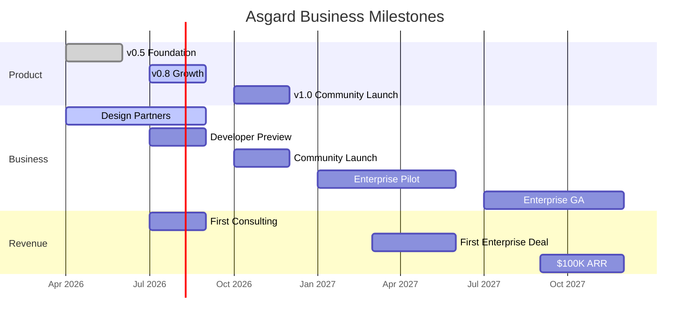

# 🏰 Asgard AI Platform — Business Plan

> Version 1.0 · March 2026

---

## 1. Executive Summary

**Asgard** is a self-hosted AI platform that gives organizations complete control over their AI stack — from LLM inference to RAG pipelines to autonomous agents — running on their own hardware with zero cloud dependency.

**What's built:** 23 sprints delivered across 5 components, 37 features, 255+ tests. Mimir (core platform) is production-ready with multi-tenant IAM, Agent Studio, Knowledge Graph, and Coverage Analytics.

**Market opportunity:** The AI platform market is $28B (2025) growing to $147B by 2030. Self-hosted solutions for regulated industries (healthcare, legal, finance) represent a $4.2B segment with 35% CAGR.

**Revenue model:** Open-core (AGPL-3.0 Community + Commercial Enterprise License). Enterprise pricing starts at $5,000/year per instance.

**Ask:** Bootstrapped initially. Seeking $500K seed round for Year 2 expansion.

---

## 2. Problem Statement

| Pain Point | Who Feels It | Current Solutions |
|:--|:--|:--|
| **Data sovereignty** | Healthcare, legal, finance | Cloud AI = data sent externally |
| **Vendor lock-in** | All enterprises | OpenAI/Azure proprietary APIs |
| **Cost at scale** | High-volume users | $0.01/token adds up fast |
| **Compliance (HIPAA/PDPA)** | Regulated industries | Build from scratch or accept risk |
| **Integration complexity** | Engineering teams | Glue together 5-10 tools |

---

## 3. Solution

Asgard is a **complete, modular, self-hosted AI platform**:

| Component | What it Does | Unique Value |
|:--|:--|:--|
| 🛡️ Heimdall | LLM Gateway | MLX native on Apple Silicon, vLLM on NVIDIA |
| 🧠 Mimir | RAG + Agent Builder | Full pipeline: ingest → chunk → embed → retrieve → generate |
| ⚡ Bifrost | Agent Runtime | ReAct loop, MCP tools, A2A protocol |
| 🐺 Fenrir | Computer Use | Browser/shell automation for agents |
| 🌳 Yggdrasil | Auth | Centralized SSO (Yggdrasil) |

**Key differentiator:** Only platform that natively supports Apple Silicon (MLX) AND NVIDIA (vLLM) for local inference, with a complete RAG + Agent pipeline built in Rust for performance.

---

## 4. Market Analysis

### TAM → SAM → SOM

| Level | Market | Size (2026) | Source |
|:--|:--|:--|:--|
| **TAM** | Global AI Platform Market | $28B | Gartner, MarketsandMarkets |
| **SAM** | Self-hosted AI for regulated industries | $4.2B | 15% of TAM, healthcare+legal+finance |
| **SOM** | SEA market, SMB-mid enterprises | $42M | 1% of SAM, Thailand+Singapore+Vietnam |

### Target Segments (Priority Order)

| Segment | Why | Willingness to Pay |
|:--|:--|:--|
| 🏥 **Healthcare (Thailand)** | PDPA compliance, medical data sensitivity | High ($2K-5K/mo) |
| 🎮 **Game Studios (SEA)** | NPC AI, content generation, local inference | Medium ($500-2K/mo) |
| ⚖️ **Legal Firms** | Document analysis, confidentiality requirements | High ($2K-5K/mo) |
| 🏦 **Financial Services** | Risk analysis, regulatory compliance | Very High ($5K+/mo) |

---

## 5. Business Model & Revenue Streams

| Stream | Type | Timing | Margin |
|:--|:--|:--|:--|
| **Enterprise License** | Recurring (annual) | Year 2+ | ~95% |
| **Hardware Bundles** | One-time + support | Year 1+ | 40-50% |
| **Support & SLA** | Recurring (annual) | Year 2+ | ~90% |
| **Consulting** | One-time | Year 1+ | ~80% |
| **Training & Workshops** | One-time | Year 2+ | ~85% |

> See [pricing-strategy.md](../business/pricing-strategy.md) for hardware bundle tiers: Mini ($2.5K), Pro ($3.8K), Studio ($5.9K), Ultra ($9.5K), GPU ($6-15K)

### Pricing Tiers

| Tier | Annual Price | Target |
|:--|:--|:--|
| Community | Free (AGPL-3.0) | Developers, startups |
| Starter Enterprise | $5,000/yr | Small teams |
| Professional Enterprise | $20,000/yr | Mid-size orgs |
| Custom Enterprise | $50K-200K/yr | Large enterprises |

> See [pricing-strategy.md](../business/pricing-strategy.md) for full details.

---

## 6. Go-to-Market Strategy

> See [go-to-market.md](../business/go-to-market.md) for full details.

| Phase | Timeline | Goal |
|:--|:--|:--|
| **Stealth** | Now - Q2 2026 | Build core, recruit design partners |
| **Developer Preview** | Q3 2026 | GitHub launch, early adopter feedback |
| **Community Launch** | Q4 2026 | v1.0, Product Hunt, HackerNews |
| **Enterprise Pilot** | Q1 2027 | 3-5 paying design partners |
| **Enterprise GA** | Q3 2027 | Sales team, channel partners |

---

## 7. Financial Projections (3-Year)

### Revenue Forecast

| | Year 1 (2026) | Year 2 (2027) | Year 3 (2028) |
|:--|:--|:--|:--|
| Enterprise Licenses | $0 | $180K | $774K |
| Hardware Bundles | $15K | $80K | $200K |
| Consulting | $30K | $60K | $100K |
| Training | $0 | $20K | $50K |
| **Total Revenue** | **$45K** | **$340K** | **$1,124K** |

### Cost Structure

| | Year 1 | Year 2 | Year 3 |
|:--|:--|:--|:--|
| Hardware COGS (60%) | $9K | $48K | $120K |
| Engineering (founder) | $0* | $120K | $240K |
| Infrastructure (servers, domains) | $5K | $12K | $30K |
| Marketing & Community | $5K | $30K | $60K |
| Sales | $0 | $60K | $120K |
| Legal & Admin | $5K | $10K | $20K |
| **Total Costs** | **$24K** | **$280K** | **$590K** |
| **Net** | **$21K** | **$60K** | **$534K** |

*Assumption: Year 1 founder works without salary, bootstrapped. Hardware COGS ~60% of hardware revenue.*

### Key Assumptions
- Community Edition drives 10x awareness vs paid marketing
- Enterprise conversion from Community: 2-5% by Year 2
- SEA market first (Thailand → Singapore → Vietnam)
- Average Enterprise contract: $12K-20K/yr
- Churn rate: < 10% annually (self-hosted = sticky)

---

## 8. Team & Resources

### Current (Year 1)
| Role | Person | Focus |
|:--|:--|:--|
| Founder/CTO | Paripol | Architecture, Rust backend, AI strategy |

### Year 2 Target
| Role | Hire When | Budget |
|:--|:--|:--|
| Full-stack Engineer | $100K ARR | Mimir Dashboard, Bifrost |
| DevRel / Community Manager | Community launch | Content, docs, support |
| Sales (part-time) | First enterprise deal | Enterprise pipeline |

### Year 3 Target
| Role | Count |
|:--|:--|
| Engineering | 3-4 |
| Sales & Marketing | 2 |
| Support | 1 |

---

## 9. Milestones & Timeline

---

## 10. Risks & Mitigation

| Risk | Probability | Impact | Mitigation |
|:--|:--|:--|:--|
| **Dify/competitor catches up** | Medium | High | Move fast; MLX native is hard to replicate |
| **Apple Silicon niche too small** | Low | Medium | vLLM support covers NVIDIA; dual-platform |
| **Solo founder bottleneck** | High | High | Hire first engineer at $100K ARR |
| **Enterprise sales cycle too long** | Medium | Medium | Start with design partners (free); reduce friction |
| **AGPL compliance monitoring** | Low | Low | License key enforcement; AGPL copyleft protects |
| **Open source fork** | Low | Medium | Stay ahead; Enterprise features create value gap |

---

## 11. Funding & Use of Proceeds

### Bootstrap Phase (Current)
- Self-funded by founder
- Revenue from consulting covers infrastructure costs
- Focus: ship v1.0, recruit design partners

### Seed Round (Target: Q2 2027)
| Item | Ask |
|:--|:--|
| **Amount** | $500K |
| **Use** | Hire 2 engineers + DevRel + 12 months runway |
| **Valuation** | $3-5M (pre-money) |
| **Milestone** | $100K ARR, 500+ GitHub stars, 3+ enterprise pilots |

### Use of Proceeds
| Category | Amount | % |
|:--|:--|:--|
| Engineering | $300K | 60% |
| Marketing & Community | $100K | 20% |
| Operations & Legal | $50K | 10% |
| Reserve | $50K | 10% |

---

*📅 Created: March 2026 · Contact: paripol@megawiz.co*
