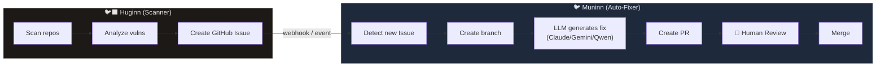
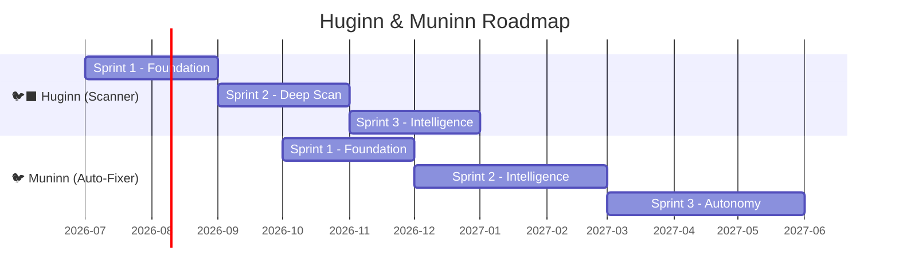

# 🐦‍⬛ Huginn & 🐦 Muninn — Enterprise Security Roadmap

> นกกาของ Odin สองตัวที่บินไปสำรวจทั่วโลกทุกวัน แล้วกลับมารายงาน.\
> Asgard เป็นของทุกคนแล้ว — Asgard belongs to everyone.

---

## Overview

| Service | Codename | Role | Edition |
|:--|:--|:--|:--|
| 🐦‍⬛ **Huginn** | "Thought" | Security Scanner — สำรวจ, วิเคราะห์, สร้าง Issue | Enterprise |
| 🐦 **Muninn** | "Memory" | Auto-Fixer — สร้าง Branch, LLM Code Fix, PR | Enterprise |

---

## 🐦‍⬛ Huginn — Security Scanner

### Sprint 1: Foundation (Q3 2026)
| Task | Description |
|:--|:--|
| Project scaffold | Python (FastAPI) + GitHub API (PyGithub) |
| SAST engine | Integrate Semgrep for static analysis |
| Secret scanner | Detect hardcoded secrets (API keys, passwords, tokens) |
| Dependency audit | Check CVEs via `pip audit`, `cargo audit`, `npm audit` |
| GitHub Issue creator | Auto-create issues with severity labels + code snippets |
| Dashboard API | GET /api/scans — scan history + stats |

### Sprint 2: Deep Scan (Q3 2026)
| Task | Description |
|:--|:--|
| Docker image scan | Trivy integration for container vulnerabilities |
| OWASP Top 10 | SQL injection, XSS, CSRF detection rules |
| License compliance | Detect incompatible licenses (GPL in Enterprise) |
| Scheduled scanning | Cron-based full repo scan (daily/weekly) |
| Webhook trigger | Scan on every push/PR via GitHub webhook |
| Severity scoring | CVSS-based priority (Critical/High/Medium/Low) |

### Sprint 3: Intelligence (Q4 2026)
| Task | Description |
|:--|:--|
| LLM-assisted analysis | Use Heimdall LLM to explain vulnerabilities in context |
| Cross-repo correlation | Find same vulnerability pattern across all Asgard repos |
| Trend dashboard | Vulnerability trends over time, fix rate metrics |
| Compliance reports | SOC2 / HIPAA / ISO 27001 readiness reports |
| Slack/Teams alerts | Notify on Critical findings |

---

## 🐦 Muninn — Auto-Fixer

### Sprint 1: Foundation (Q4 2026)
| Task | Description |
|:--|:--|
| Project scaffold | Python (FastAPI) + GitHub API |
| Issue watcher | Listen for Huginn-created issues (label: `huginn/vulnerability`) |
| Branch creator | Auto-create `fix/huginn-{issue-id}` branches |
| LLM router | Route to Claude / Gemini / Qwen based on language + complexity |
| Code generator | Send vulnerability context + code to LLM, get fix |
| PR creator | Create PR with fix, link to original issue |

### Sprint 2: Intelligence (Q1 2027)
| Task | Description |
|:--|:--|
| Multi-file fixes | Handle fixes spanning multiple files |
| Test generation | LLM generates regression tests for the fix |
| Self-validation | Run existing tests before creating PR |
| Confidence scoring | Rate fix confidence (auto-merge high, review low) |
| Fix templates | Common patterns (dependency bump, secret rotation) |
| Rollback system | Auto-revert if CI fails after merge |

### Sprint 3: Autonomy (Q2 2027)
| Task | Description |
|:--|:--|
| Auto-merge (high confidence) | Merge dependency bumps automatically |
| Learning from reviews | Remember rejected/modified PRs to improve future fixes |
| Multi-repo orchestration | Fix same vuln across all Asgard repos in batch |
| Cost optimization | Route simple fixes to local LLM (Heimdall) |
| Audit trail | Full log of every scan → issue → fix → merge chain |

---

## 📅 Timeline

---

## 💰 Enterprise Value

| Feature | Community (Free) | Enterprise |
|:--|:--|:--|
| Manual security audit | ✅ DIY | ✅ |
| Huginn auto-scan | ❌ | ✅ |
| GitHub Issue auto-create | ❌ | ✅ |
| Muninn auto-fix | ❌ | ✅ |
| LLM-powered code fixes | ❌ | ✅ |
| Compliance reports | ❌ | ✅ |
| Auto-merge (high confidence) | ❌ | ✅ |
| Multi-repo orchestration | ❌ | ✅ |

---

## 🏰 Asgard Component Map (Updated)

| Component | Role | Edition |
|:--|:--|:--|
| 🛡️ Heimdall | LLM Gateway | Community |
| 🧠 Mimir | Knowledge + RAG | Community |
| ⚡ Bifrost | Agent Runtime | Community |
| 🐺 Fenrir | Computer Use | Community |
| 🏥 Eir | Clinical (OpenEMR) | Community |
| 🌳 Yggdrasil | Auth (Zitadel) | Community |
| 🐦‍⬛ **Huginn** | **Security Scanner** | **Enterprise** |
| 🐦 **Muninn** | **Auto-Fixer** | **Enterprise** |

---

*Asgard เป็นของทุกคนแล้ว — Asgard belongs to everyone.*
