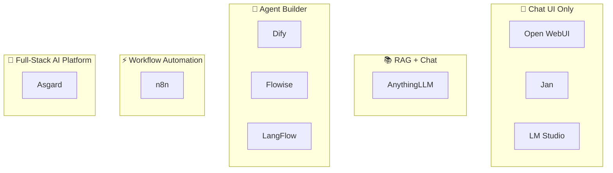
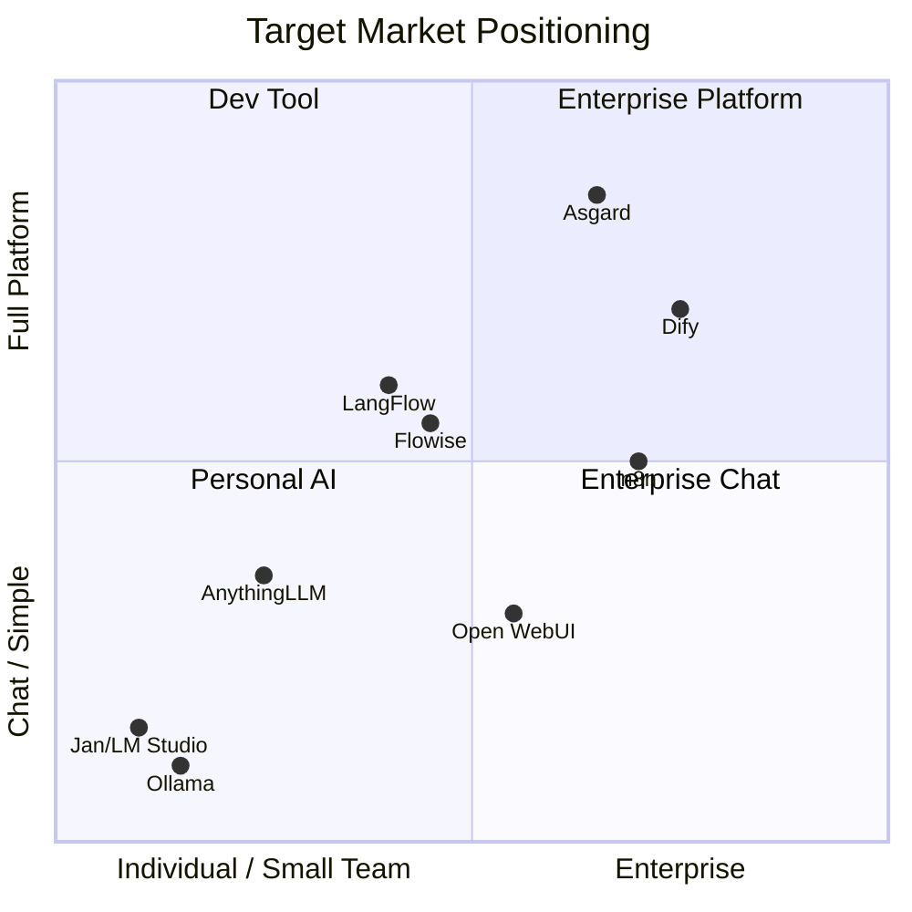

# 🏰 Asgard — Competitor & Target Market Analysis

> Competitor analysis, target market mapping, and market gaps where Asgard can differentiate.

---

## 1. Competitor Landscape



---

## 2. Competitor Breakdown

### 💬 Open WebUI

| | |
|:--|:--|
| **Type** | Chat UI for Ollama / OpenAI-compatible backends |
| **Target** | 🧑‍💻 Developers, Homelab, Universities, Enterprise |
| **Customers** | Samsung Semiconductor, Johannes Gutenberg University (30K+) |
| **Pricing** | Free (MIT License) |
| **Strengths** | ⭐ 80K+ GitHub stars, beautiful UI, RBAC, SCIM 2.0 |
| **Weaknesses** | No RAG pipeline, no Agent runtime, no Gateway |
| **Where Asgard wins** | Full-stack (Gateway + RAG + Agent + Computer Use) |

---

### 📚 AnythingLLM

| | |
|:--|:--|
| **Type** | RAG + Chat (All-in-one local AI) |
| **Target** | 🧑‍💻 Individuals, Small teams, Privacy-conscious users |
| **Pricing** | Desktop free (MIT), Cloud ~$50/month |
| **Strengths** | Very easy to use, supports many document formats |
| **Weaknesses** | No multi-tenancy, no Agent runtime, no Gateway |
| **Where Asgard wins** | Multi-tenant, Enterprise features, Gateway |

---

### 🤖 Dify — **Primary Competitor**

| | |
|:--|:--|
| **Type** | LLM App Builder (Low-code) |
| **Target** | 🏢 Mid-market B2B, Enterprise |
| **Pricing** | Free self-host, Cloud $59-159/month, Enterprise ¥500K/year |
| **GitHub** | ⭐ 60K+ stars |
| **Strengths** | Visual workflow, Plugin marketplace, Full Enterprise features |
| **Weaknesses** | ❌ No LLM Gateway, ❌ No Computer Use, ❌ Requires cloud APIs |
| **Where Asgard wins** | **Native local inference** (MLX/vLLM), Gateway, Computer Use |

---

### ⚡ Flowise

| | |
|:--|:--|
| **Type** | LLM Workflow Builder (Low-code) |
| **Target** | 🧑‍💻 Developers, Small teams |
| **Pricing** | Free (Apache 2.0), Cloud $35-65/month |
| **Strengths** | Drag-and-drop UI, Human-in-the-Loop |
| **Weaknesses** | ❌ No Gateway, ❌ No Computer Use |

---

### 🔀 LangFlow

| | |
|:--|:--|
| **Type** | Visual AI Workflow Builder (Developer-focused) |
| **Target** | 🧑‍💻 Developers, AI researchers |
| **Pricing** | Free (MIT), Enterprise $2K+/month |
| **Weaknesses** | Too technical, requires manual assembly |

---

### ⚙️ n8n

| | |
|:--|:--|
| **Type** | Workflow Automation + AI features |
| **Target** | 🏢 Business automation, IT ops |
| **Pricing** | Free self-host, Cloud €20-800/month |
| **Weaknesses** | AI is just an add-on feature, not core |

---

## 3. 📊 Feature Comparison Matrix

| Feature | Asgard | Dify | Open WebUI | AnythingLLM | Flowise | n8n |
|:--|:--|:--|:--|:--|:--|:--|
| **LLM Gateway** | ✅ Heimdall | ❌ | ❌ | ❌ | ❌ | ❌ |
| **Native Local Inference** | ✅ MLX+vLLM | ❌ Cloud APIs | ⚠️ via Ollama | ⚠️ via Ollama | ❌ | ❌ |
| **RAG Pipeline** | ✅ Mimir | ✅ | ⚠️ Basic | ✅ | ✅ | ⚠️ |
| **Agent Runtime** | ✅ Bifrost | ✅ | ❌ | ❌ | ✅ | ⚠️ |
| **Computer Use** | ✅ Fenrir | ❌ | ❌ | ❌ | ❌ | ❌ |
| **Multi-Tenant** | ✅ | ✅ | ⚠️ | ❌ | ❌ | ⚠️ |
| **SSO/SAML** | ✅ Zitadel | ✅ | ⚠️ | ❌ | ✅ Ent | ✅ Ent |
| **Self-Host** | ✅ 100% | ✅ | ✅ | ✅ | ✅ | ✅ |
| **Apple Silicon** | ✅ Native | ❌ | ⚠️ | ⚠️ | ❌ | ❌ |
| **NVIDIA GPU** | 🟢 vLLM | ❌ | ⚠️ | ⚠️ | ❌ | ❌ |
| **License** | AGPL-3.0 | Apache 2.0 | MIT | MIT | Apache 2.0 | Sustainable |

---

## 4. 🎯 Target Market Positioning



| Competitor | Primary Target | Secondary Target |
|:--|:--|:--|
| **Open WebUI** | 🧑‍💻 Developer / Homelab | 🏫 University / Enterprise IT |
| **AnythingLLM** | 🧑 Individual / Small team | 🔒 Privacy-focused orgs |
| **Dify** | 🏢 Mid-market B2B / Enterprise | 🧑‍💻 Technical teams |
| **Flowise** | 🧑‍💻 Developer / Small team | 🏢 Enterprise (custom plan) |
| **LangFlow** | 🧑‍💻 Developer / AI researcher | 🏢 Enterprise (self-setup) |
| **n8n** | 🏢 Business / IT ops | 🧑‍💻 Developer |
| **Ollama/LocalAI** | 🧑‍💻 Developer / Tinkerer | — |

---

## 5. 🕳️ Market Gaps

> **No one in the market delivers "Full-Stack Self-Hosted AI + Local Inference + Enterprise Features" completely.**

| # | Gap | Explanation |
|:--|:--|:--|
| 1 | **Gateway + Inference + RAG in one platform** | Dify requires cloud APIs, AnythingLLM has no Gateway |
| 2 | **Enterprise Self-Host 100%** | Dify leans cloud, Flowise/LangFlow need cloud APIs |
| 3 | **Dual Hardware (Apple + NVIDIA)** | No one supports both MLX + vLLM |

### Underserved Customer Segments

| Segment | Why Asgard fits |
|:--|:--|
| 🏥 **Healthcare SME** | Patient data is sensitive → 100% local |
| ⚖️ **Legal Firm** | Confidential documents → RAG + local inference |
| 🏦 **Financial SME** | Compliance → Audit trail (Zitadel) |
| 🎮 **Game Studio** | IP protection + Fenrir (automated QA) + NPC AI |
| 🏭 **Manufacturing** | Air-gapped environments → Offline capable |
| 🏛️ **Government** | Must self-host + compliance |
| 🎓 **University** | Limited budget → Free community + multi-tenant |

---

## 6. 💡 Recommended Target Market

### Tier 1 — Launch First (Community Edition)

> **🏥 Healthcare + ⚖️ Legal + 🏦 Financial + 🎮 Game Studio**

| Rationale | |
|:--|:--|
| **Clear pain** | Data must stay on-premise → self-host only → Dify doesn't fit |
| **Budget ready** | SMEs in these 4 segments have IT infrastructure budget |
| **Compliance** | PDPA / HIPAA / financial regulations → audit trail |
| **Right size** | 10-200 users → Mac Mini/DGX Spark is sufficient |

#### 🎮 Game Industry Use Cases

| Use Case | Asgard Component |
|:--|:--|
| **NPC AI / Dialog** | Bifrost + Heimdall |
| **Automated Game Testing** | 🐺 Fenrir (Computer Use) — **unique to Asgard** |
| **Procedural Content** | Bifrost + Mimir (RAG) |
| **IP Protection** | 100% Local Inference |
| **Hardware Match** | Mac (design) + NVIDIA (rendering) |

### Tier 2 — Growth (Enterprise Edition)

> **🏭 Manufacturing + 🏛️ Government + 🎓 University**

---

## 7. 🎯 Positioning Statement

```
For     : SMEs that need AI but data cannot leave the company
Asgard  : Full-stack self-hosted AI platform
Unlike  : Dify, Open WebUI, AnythingLLM
Because : Only platform combining LLM Gateway + RAG + Agent + Computer Use
          with native inference on both Apple Silicon and NVIDIA GPU
          Data never leaves your premises — 100% secure
```

---

*📅 Last updated: March 2026*
