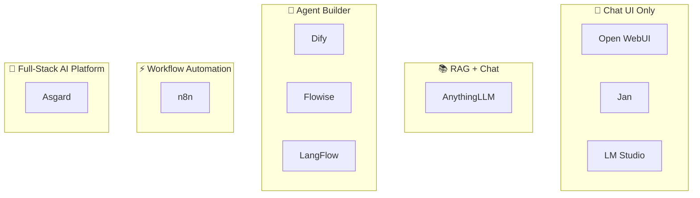
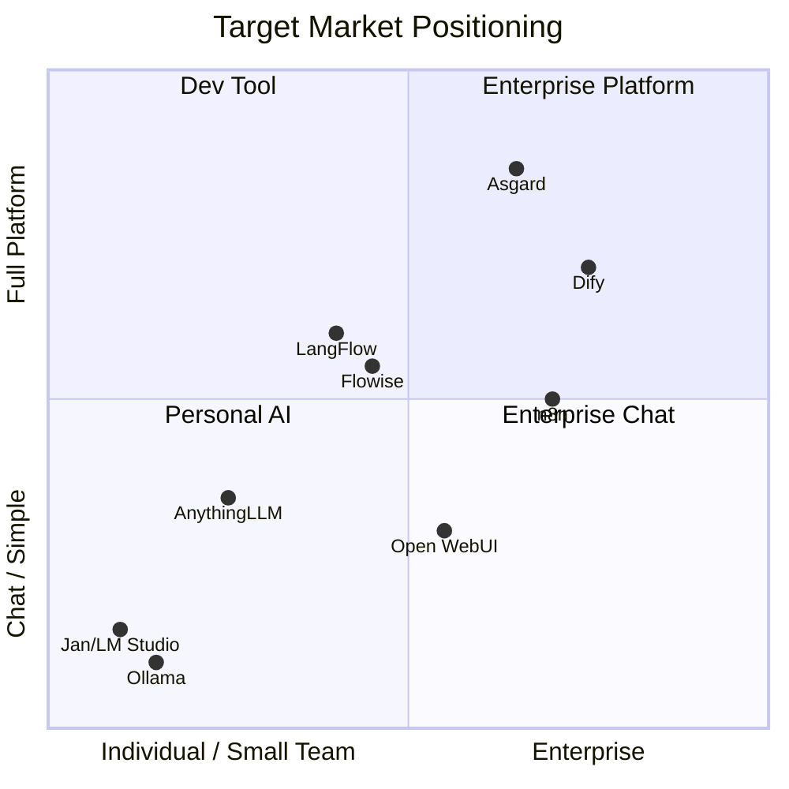

# 🏰 Asgard — Competitor & Target Market Analysis

> วิเคราะห์คู่แข่ง, target ของคู่แข่ง, และช่องว่างในตลาดที่ Asgard สามารถเข้าไปแย่งได้

---

## 1. Competitor Landscape



---

## 2. เปรียบเทียบคู่แข่งรายตัว

### 💬 Open WebUI

| | |
|:--|:--|
| **ประเภท** | Chat UI สำหรับ Ollama / OpenAI-compatible |
| **Target** | 🧑‍💻 Developer, Homelab, มหาวิทยาลัย, Enterprise |
| **ลูกค้าตัวอย่าง** | Samsung Semiconductor, Johannes Gutenberg University (30K+) |
| **ราคา** | ฟรี (MIT License) |
| **จุดแข็ง** | ⭐ 80K+ GitHub stars, UI สวย, RBAC, SCIM 2.0 |
| **จุดอ่อน** | ไม่มี RAG pipeline, ไม่มี Agent runtime, ไม่มี Gateway |
| **Asgard ชนะตรงไหน** | Full-stack (Gateway + RAG + Agent + Computer Use) |

---

### 📚 AnythingLLM

| | |
|:--|:--|
| **ประเภท** | RAG + Chat (All-in-one local AI) |
| **Target** | 🧑‍💻 Individual, Small team, Privacy-conscious users, Offline env |
| **ราคา** | Desktop ฟรี (MIT), Cloud ~$50/month |
| **จุดแข็ง** | ง่ายมาก, รองรับ document หลายแบบ |
| **จุดอ่อน** | ไม่มี multi-tenancy, ไม่มี Agent runtime, ไม่มี Gateway |
| **Asgard ชนะตรงไหน** | Multi-tenant, Enterprise features, Gateway |

---

### 🤖 Dify — **คู่แข่งหลัก**

| | |
|:--|:--|
| **ประเภท** | LLM App Builder (Low-code) |
| **Target** | 🏢 Mid-market B2B, Enterprise |
| **ราคา** | Free self-host, Cloud $59-159/month, Enterprise ¥500K/year |
| **GitHub** | ⭐ 60K+ stars |
| **จุดแข็ง** | Visual workflow, Plugin marketplace, Enterprise features ครบ |
| **จุดอ่อน** | ❌ ไม่มี LLM Gateway, ❌ ไม่มี Computer Use, ❌ ต้องใช้ cloud APIs |
| **Asgard ชนะตรงไหน** | **Native local inference** (MLX/vLLM), Gateway, Computer Use |

---

### ⚡ Flowise

| | |
|:--|:--|
| **ประเภท** | LLM Workflow Builder (Low-code) |
| **Target** | 🧑‍💻 Developer, Small team |
| **ราคา** | Free (Apache 2.0), Cloud $35-65/month |
| **จุดแข็ง** | Drag-and-drop UI, Human-in-the-Loop |
| **จุดอ่อน** | ❌ ไม่มี Gateway, ❌ ไม่มี Computer Use |

---

### 🔀 LangFlow

| | |
|:--|:--|
| **ประเภท** | Visual AI Workflow Builder (Developer-focused) |
| **Target** | 🧑‍💻 Developer, AI researchers |
| **ราคา** | Free (MIT), Enterprise $2K+/month |
| **จุดอ่อน** | Technical เกินไป, ต้องประกอบเอง |

---

### ⚙️ n8n

| | |
|:--|:--|
| **ประเภท** | Workflow Automation + AI features |
| **Target** | 🏢 Business automation, IT ops |
| **ราคา** | Free self-host, Cloud €20-800/month |
| **จุดอ่อน** | AI เป็นแค่ feature เสริม ไม่ใช่ core |

---

## 3. 📊 Feature Comparison Matrix

| Feature | Asgard | Dify | Open WebUI | AnythingLLM | Flowise | n8n |
|:--|:--|:--|:--|:--|:--|:--|
| **LLM Gateway** | ✅ Heimdall | ❌ | ❌ | ❌ | ❌ | ❌ |
| **Native Local Inference** | ✅ MLX+vLLM | ❌ Cloud APIs | ⚠️ via Ollama | ⚠️ via Ollama | ❌ | ❌ |
| **RAG Pipeline** | ✅ Mimir | ✅ | ⚠️ Basic | ✅ | ✅ | ⚠️ |
| **Agent Runtime** | ✅ Bifrost | ✅ | ❌ | ❌ | ✅ | ⚠️ |
| **Computer Use** | ✅ Fenrir | ❌ | ❌ | ❌ | ❌ | ❌ |
| **Multi-Tenant** | ✅ | ✅ | ⚠️ | ❌ | ❌ | ⚠️ |
| **SSO/SAML** | ✅ Zitadel | ✅ | ⚠️ | ❌ | ✅ Ent | ✅ Ent |
| **Self-Host** | ✅ 100% | ✅ | ✅ | ✅ | ✅ | ✅ |
| **Apple Silicon** | ✅ Native | ❌ | ⚠️ | ⚠️ | ❌ | ❌ |
| **NVIDIA GPU** | 🟢 vLLM | ❌ | ⚠️ | ⚠️ | ❌ | ❌ |
| **License** | AGPL-3.0 | Apache 2.0 | MIT | MIT | Apache 2.0 | Sustainable |

---

## 4. 🎯 Target Market Positioning



| Competitor | Primary Target | Secondary Target |
|:--|:--|:--|
| **Open WebUI** | 🧑‍💻 Developer / Homelab | 🏫 University / Enterprise IT |
| **AnythingLLM** | 🧑 Individual / Small team | 🔒 Privacy-focused orgs |
| **Dify** | 🏢 Mid-market B2B / Enterprise | 🧑‍💻 Technical teams |
| **Flowise** | 🧑‍💻 Developer / Small team | 🏢 Enterprise (custom plan) |
| **LangFlow** | 🧑‍💻 Developer / AI researcher | 🏢 Enterprise (self-setup) |
| **n8n** | 🏢 Business / IT ops | 🧑‍💻 Developer |
| **Ollama/LocalAI** | 🧑‍💻 Developer / Tinkerer | — |

---

## 5. 🕳️ Market Gaps

> **ไม่มีใครในตลาดที่ deliver "Full-Stack Self-Hosted AI + Local Inference + Enterprise Features" ได้ครบ**

| # | Gap | อธิบาย |
|:--|:--|:--|
| 1 | **Gateway + Inference + RAG ในตัวเดียว** | Dify ต้องใช้ cloud API, AnythingLLM ไม่มี Gateway |
| 2 | **Enterprise Self-Host 100%** | Dify เน้น cloud, Flowise/LangFlow ต้องต่อ cloud APIs |
| 3 | **Dual Hardware (Apple + NVIDIA)** | ไม่มีใครรองรับทั้ง MLX + vLLM |

### กลุ่มลูกค้าที่ยังไม่มีใครจับ

| กลุ่ม | ทำไม Asgard เหมาะ |
|:--|:--|
| 🏥 **Healthcare SME** | ข้อมูลผู้ป่วย sensitive → 100% local |
| ⚖️ **Legal Firm** | เอกสาร confidential → RAG + local inference |
| 🏦 **Financial SME** | Compliance → Audit trail (Zitadel) |
| 🎮 **Game Studio** | IP protection + Fenrir (automated QA) + NPC AI |
| 🏭 **Manufacturing** | Air-gapped → Offline capable |
| 🏛️ **Government** | ต้อง self-host + compliance |
| 🎓 **University** | Budget จำกัด → Free community + multi-tenant |

---

## 6. 💡 Recommended Target Market

### Tier 1 — Launch First (Community Edition)

> **🏥 Healthcare + ⚖️ Legal + 🏦 Financial + 🎮 Game Studio**

| เหตุผล | |
|:--|:--|
| **Pain ชัด** | ข้อมูลห้ามออก → self-host only → Dify ไม่ตอบโจทย์ |
| **งบพร้อม** | SME ใน 4 กลุ่มนี้มี budget สำหรับ IT infra |
| **Compliance** | PDPA / HIPAA / financial regulations → audit trail |
| **ขนาดพอดี** | 10-200 users → Mac Mini/DGX Spark พอ |

#### 🎮 Game Industry Use Cases

| Use Case | Asgard Component |
|:--|:--|
| **NPC AI / Dialog** | Bifrost + Heimdall |
| **Automated Game Testing** | 🐺 Fenrir (Computer Use) — **unique to Asgard** |
| **Procedural Content** | Bifrost + Mimir (RAG) |
| **IP Protection** | 100% Local Inference |
| **Hardware Match** | Mac (design) + NVIDIA (rendering) |

### Tier 2 — Growth (Enterprise Edition)

> **🏭 Manufacturing + 🏛️ Government + 🎓 University**

---

## 7. 🎯 Positioning Statement

```
For     : SMEs that need AI but data cannot leave the company
Asgard  : Full-stack self-hosted AI platform
Unlike  : Dify, Open WebUI, AnythingLLM
Because : Only platform combining LLM Gateway + RAG + Agent + Computer Use
          with native inference on both Apple Silicon and NVIDIA GPU
          Data never leaves your premises — 100% secure
```

---

*📅 Last updated: March 2026*
