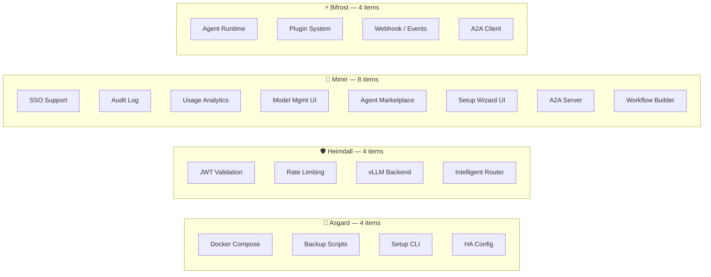

# 🗺️ Gap → Project Mapping Analysis

> วิเคราะห์ว่าแต่ละ gap ควร implement ไว้ใน project ไหน หรือต้องสร้างใหม่
>
> อ้างอิงจากสถานะจริงของทุก repo (ตรวจสอบ 7 มี.ค. 2026)

---

## สถานะปัจจุบันของแต่ละ Repo

| Repo | Tech | สถานะ | มีอะไรแล้ว |
|:--|:--|:--|:--|
| 🧠 **Mimir** | Rust (Axum+Rig.rs), Next.js 14 | ✅ Sprint 1-8 | Multi-Tenant IAM, Dashboard, RAG Pipeline, Data Ingress |
| 🛡️ **Heimdall** | Rust (Axum) | ✅ Production | Gateway proxy, SSE streaming, Prometheus |
| ⚡ **Bifrost** | Python (FastAPI) | 🚧 Scaffolding | Project structure, Dockerfile |
| 🐺 **Fenrir** | Rust (ZeroClaw) | 📋 Planned | README + design |
| 🏰 **Asgard** | — | 📄 Docs | README, architecture.md |

---

## 🔴 Critical Gaps

### 1. Centralized Auth — 🌳 Yggdrasil (Zitadel)

> ✅ **ตัดสินใจแล้ว:** ใช้ Zitadel เป็น Yggdrasil
> 📄 ดูรายละเอียดที่ [yggdrasil-auth-selection.md](../technical/yggdrasil-auth-selection.md)

| Implement ที่ไหน | Action |
|:--|:--|
| 🏰 **Asgard** docker-compose | Deploy Zitadel + Postgres |
| 🛡️ **Heimdall** | Validate Zitadel JWT |
| 🧠 **Mimir** | Delegate login → Zitadel (OIDC) |
| ⚡ **Bifrost** | Validate Zitadel JWT middleware |

### 2. Unified Docker Compose → 🏰 Asgard

### 3. Backup/Restore → 🏰 Asgard `scripts/backup.sh`

### 4. Bifrost Agent Runtime → ⚡ Bifrost

### 5. Setup Wizard → 🏰 Asgard `scripts/setup.sh` + 🧠 Mimir Web UI

### 6. Heimdall vLLM Backend → 🛡️ Heimdall

### 7. A2A Protocol (Agent-to-Agent) → 🧠 Mimir + ⚡ Bifrost

> ✅ **ตัดสินใจแล้ว:** Support A2A ใน Mimir

[A2A](https://github.com/google/A2A) คือ open standard จาก Google (อยู่ใน Linux Foundation) สำหรับให้ agent คุยกันข้าม platform ได้

| | |
|:--|:--|
| **มาตรฐาน** | HTTP + JSON-RPC + SSE (เหมือน web stack ปกติ) |
| **เสริมกับ MCP** | MCP = agent ↔ tools, **A2A = agent ↔ agent** |
| **Agent Card** | JSON ที่อธิบาย capabilities ของ agent → ใช้สำหรับ discovery |
| **Task lifecycle** | submitted → working → completed/failed |

| Implement ที่ไหน | Action |
|:--|:--|
| 🧠 **Mimir** | A2A Server — expose agents as A2A endpoints + Agent Card registry |
| ⚡ **Bifrost** | A2A Client — ให้ agent เรียก external A2A agents ได้ |
| 🛡️ **Heimdall** | A2A proxy/auth — route + validate A2A requests |

---

## 🟡 Important Gaps (Enterprise Track)

| Gap | Implement | เหตุผล |
|:--|:--|:--|
| **Audit Log** | 🧠 Mimir | มี DB + API layer แล้ว |
| **Rate Limiting** | 🛡️ Heimdall | Gateway = จุดตรวจสอบ |
| **SSO** | 🌳 Zitadel | ได้มาฟรี |
| **HA / Clustering** | 🏰 Asgard compose | Docker Swarm/K8s config |
| **Usage Analytics** | 🧠 Mimir Dashboard | เพิ่ม analytics page |
| **Model Management UI** | 🧠 Mimir Dashboard | เพิ่มหน้าจัดการ model |

---

## 📊 Summary

> **ไม่ต้องสร้าง project ใหม่เลย** — ทุก gap map ลง project ที่มีอยู่ได้ทั้งหมด

---

*📅 Last updated: March 2026*
