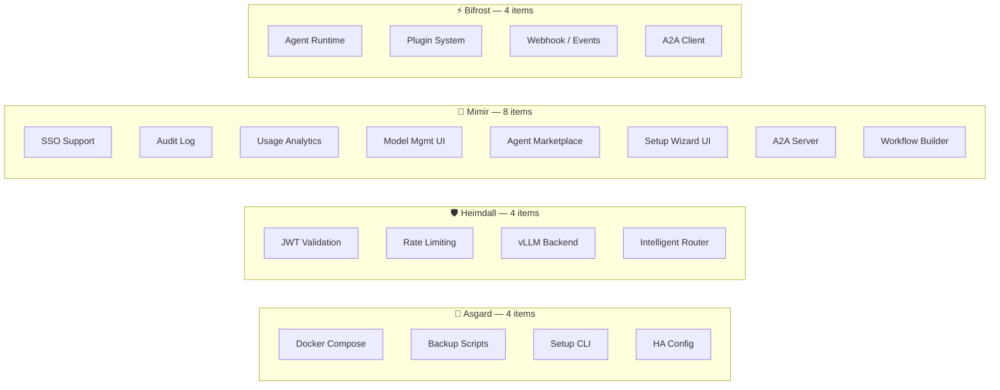

# 🗺️ Gap → Project Mapping Analysis

> Analysis of which project each gap should be implemented in, or whether a new project is needed.
>
> Based on actual repo status as of March 7, 2026.

---

## Current Status by Repo

| Repo | Tech | Status | What exists |
|:--|:--|:--|:--|
| 🧠 **Mimir** | Rust (Axum+Rig.rs), Next.js 14 | ✅ Sprint 1-8 | Multi-Tenant IAM, Dashboard, RAG Pipeline, Data Ingress |
| 🛡️ **Heimdall** | Rust (Axum) | ✅ Production | Gateway proxy, SSE streaming, Prometheus |
| ⚡ **Bifrost** | Python (FastAPI) | 🚧 Scaffolding | Project structure, Dockerfile |
| 🐺 **Fenrir** | Rust (ZeroClaw) | 📋 Planned | README + design |
| 🏰 **Asgard** | — | 📄 Docs | README, architecture.md |

---

## 🔴 Critical Gaps

### 1. Centralized Auth — 🌳 Yggdrasil (Zitadel)

> ✅ **Decided:** Use Zitadel as Yggdrasil
> 📄 See details at [yggdrasil-auth-selection.md](../technical/yggdrasil-auth-selection.md)

| Where to implement | Action |
|:--|:--|
| 🏰 **Asgard** docker-compose | Deploy Zitadel + Postgres |
| 🛡️ **Heimdall** | Validate Zitadel JWT |
| 🧠 **Mimir** | Delegate login → Zitadel (OIDC) |
| ⚡ **Bifrost** | Validate Zitadel JWT middleware |

### 2. Unified Docker Compose → 🏰 Asgard

### 3. Backup/Restore → 🏰 Asgard `scripts/backup.sh`

### 4. Bifrost Agent Runtime → ⚡ Bifrost

### 5. Setup Wizard → 🏰 Asgard `scripts/setup.sh` + 🧠 Mimir Web UI

### 6. Heimdall vLLM Backend → 🛡️ Heimdall

### 7. A2A Protocol (Agent-to-Agent) → 🧠 Mimir + ⚡ Bifrost

> ✅ **Decided:** Support A2A in Mimir

[A2A](https://github.com/google/A2A) is an open standard from Google (hosted by Linux Foundation) enabling cross-platform agent communication.

| | |
|:--|:--|
| **Standard** | HTTP + JSON-RPC + SSE (standard web stack) |
| **Complements MCP** | MCP = agent ↔ tools, **A2A = agent ↔ agent** |
| **Agent Card** | JSON describing agent capabilities → used for discovery |
| **Task lifecycle** | submitted → working → completed/failed |

| Where to implement | Action |
|:--|:--|
| 🧠 **Mimir** | A2A Server — expose agents as A2A endpoints + Agent Card registry |
| ⚡ **Bifrost** | A2A Client — enable agents to call external A2A agents |
| 🛡️ **Heimdall** | A2A proxy/auth — route + validate A2A requests |

---

## 🟡 Important Gaps (Enterprise Track)

| Gap | Implement in | Rationale |
|:--|:--|:--|
| **Audit Log** | 🧠 Mimir | Already has DB + API layer |
| **Rate Limiting** | 🛡️ Heimdall | Gateway = inspection point |
| **SSO** | 🌳 Zitadel | Included for free |
| **HA / Clustering** | 🏰 Asgard compose | Docker Swarm/K8s config |
| **Usage Analytics** | 🧠 Mimir Dashboard | Add analytics page |
| **Model Management UI** | 🧠 Mimir Dashboard | Add model management page |

---

## 📊 Summary

> **No new projects needed** — every gap maps to an existing project.

---

*📅 Last updated: March 2026*
