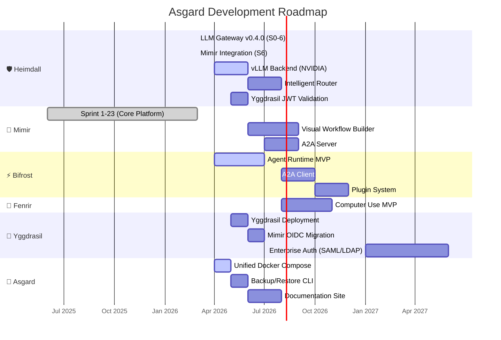

# 🗺️ Asgard — Development Roadmap

> Single source of truth for all milestones and timelines.
>
> Last updated: March 2026

---

## Roadmap Overview

---

## Now / Next / Later

### 🟢 Now (Q2 2026 — April-June)

| Milestone | Component | Status | Done Criteria |
|:--|:--|:--|:--|
| Bifrost MVP | ⚡ Bifrost | 🚧 | ReAct loop works, calls tools via MCP |
| Unified Docker Compose | 🏰 Asgard | 📋 | Single `docker compose up` starts all services |
| Heimdall vLLM | 🛡️ Heimdall | 📋 | Routes to vLLM backend on NVIDIA |
| Yggdrasil Deploy | 🌳 Yggdrasil | 📋 | Yggdrasil running, Mimir delegating login |
| Backup CLI | 🏰 Asgard | 📋 | `scripts/backup.sh` backs up MariaDB + Qdrant |

### 🔵 Next (Q3 2026 — July-September)

| Milestone | Component |
|:--|:--|
| Visual Workflow Builder | 🧠 Mimir |
| A2A Server + Client | 🧠 Mimir + ⚡ Bifrost |
| Fenrir MVP | 🐺 Fenrir |
| Documentation Site | 🏰 Asgard (asgardai.dev) |
| Intelligent Router | 🛡️ Heimdall |

### 🟣 Later (Q4 2026 — October-December)

| Milestone | Component |
|:--|:--|
| Plugin System | ⚡ Bifrost |
| Agent Marketplace | 🧠 Mimir |
| Community v1.0 Launch | 🏰 All |

> ℹ️ Knowledge Graph (Neo4j) already done in Mimir Sprint 17 (Mar 2026)

### 🔮 Future (2027+)

| Milestone | Component |
|:--|:--|
| Enterprise Edition v2.0 | 🏰 All |
| SSO / Advanced RBAC | 🌳 Yggdrasil |
| HA Clustering | 🏰 Asgard |
| White-Label | 🏰 Asgard |

---

## Release Milestones

| Version | Codename | Target | Key Deliverables |
|:--|:--|:--|:--|
| **v0.5** | Foundation | Q2 2026 | Unified Docker Compose, Bifrost MVP, Yggdrasil |
| **v0.8** | Growth | Q3 2026 | Workflow Builder, A2A, Fenrir MVP |
| **v1.0** | Community Launch | Q4 2026 | Full platform, docs site, marketplace |
| **v2.0** | Enterprise | 2027 | SSO, HA, Analytics, White-Label |

---

*📅 Last updated: March 2026*
